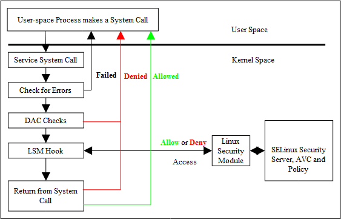

# Mandatory Access Control

Mandatory Access Control (MAC) is a type of access control in which the
operating system is used to constrain a user or process (the subject)
from accessing or performing an operation on an object (such as a file,
disk, memory etc.).

Each of the subjects and objects have a set of security attributes that
can be interrogated by the operating system to check if the requested
operation can be performed or not. For SELinux the:

-   [**subjects**](subjects.md#subjects) are processes.
-   [**objects**](objects.md#objects) are system resources such as files,
    sockets, etc.
-   security attributes are the [**security context**](security_context.md#security-context).
-   Security Server within the Linux kernel authorizes access (or not)
    using the security policy (or policy) that describes rules that must
    be enforced.

Note that the subject (and therefore the user) cannot decide to bypass
the policy rules being enforced by the MAC policy with SELinux enabled.
Contrast this to standard Linux Discretionary Access Control (DAC),
which also governs the ability of subjects to access objects, however it
allows users to make policy decisions. The steps in the decision making
chain for DAC and MAC are shown in **Figure 3**.

**Figure 3: Processing a System Call** - *The DAC checks are carried out
first, if they pass then the Security Server is consulted for a decision.*

SELinux supports two forms of MAC:

**Type Enforcement** - Where processes run in domains and the actions on
objects are controlled by policy. This is the implementation used for
general purpose MAC within SELinux along with Role Based Access Control.
The [**Type Enforcement (TE)**](type_enforcement.md#type-enforcement) and
[**Role Based Access Control**](rbac.md#role-based-access-control) sections covers
these in more detail.

**Multi-Level Security** - This is an implementation based on the
Bell-La Padula (BLP) model, and used by organizations where different
levels of access are required so that restricted information is
separated from classified information to maintain confidentiality. This
allows enforcement rules such as 'no write down' and 'no read up' to be
implemented in a policy by extending the security context to include
security levels. The [**MLS**](mls_mcs.md#multi-level-and-multi-category-security)
section covers this in more detail along with a variant called
Multi-Category Security (MCS).

The MLS / MCS services are now more generally used to maintain
application separation, for example SELinux enabled:

-   virtual machines use MCS categories to allow each VM to run within
    its own domain to isolate VMs from each other (see the
    [**SELinux Virtual Machine Support**](vm_support.md#selinux-virtual-machine-support)
    section).
-   Android devices use dynamically generated MCS categories so that an
    app running on behalf of one user cannot read or write files created
    by the same app running on behalf of another user (see the
    [**Security Enhancements for Android - Computing a Context**](seandroid.md#computing-process-context-examples) section).

<!-- %CUTHERE% -->

---
**[[ PREV ]](core_components.md)** **[[ TOP ]](#)** **[[ NEXT ]](users.md)**
