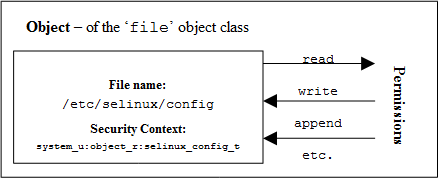
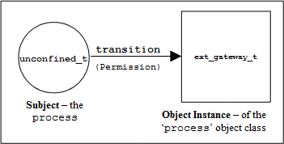

# Objects

Within SELinux an object is a resource such as files, sockets, pipes or
network interfaces that are accessed via processes (also known as
subjects). These objects are classified according to the resource they
provide with access permissions relevant to their purpose (e.g. read,
receive and write), and assigned a
[**Security Context**](security_context.md#security-context) as described
in the following sections.

## Object Classes and Permissions

Each object consists of a class identifier that defines its purpose
(e.g. file, socket) along with a set of permissions (Also known in SELinux
as Access Vectors (AV)) that describe what services the object can handle
(read, write, send etc.).
When an object is instantiated it will be allocated a name (e.g. a file
could be called config or a socket my_connection) and a security
context (e.g. `system_u:object_r:selinux_config_t`) as shown in
**Figure 5: Object Class = 'file' and permissions**.



**Figure 5: Object Class = 'file' and permissions** - *the policy rules would
define those permissions allowed for each process that needs access to
the `/etc/selinux/config` file.*

The objective of the policy is to enable the user of the object (the
subject) access to the minimum permissions needed to complete the task
(i.e. do not allow write permission if only reading information).

These object classes and their associated permissions are built into the
GNU / Linux kernel and user space object managers by developers and are
therefore not generally updated by policy writers.

The object classes consist of kernel object classes (for handling files,
sockets etc.) plus userspace object classes for userspace object
managers (for services such as X-Windows or dbus). The number of object
classes and their permissions can vary depending on the features
configured in the GNU / Linux release. All the known object classes and
permissions are described in
[**Appendix A - Object Classes and Permissions**](object_classes_permissions.md#appendix-a---object-classes-and-permissions).

## Allowing a Process Access to Resources

This is a simple example that attempts to explain two points:

1.  How a process is given permission to use an objects resource.
2.  By using the `process` object class, show that a process can be
    described as a process or object.

An SELinux policy contains many rules and statements, the majority of
which are `allow` rules that (simply) allows processes to be given
access permissions to an objects resources.

The following allow rule and **Figure 6: The `allow` rule** illustrates 'a
process can also be an object' as it allows processes running in the
`unconfined_t` domain, permission to `transition` the external gateway
application to the `ext_gateway_t` domain once it has been executed:

```
allow Rule | source_domain |  target_type  :  class  | permission
-----------▼---------------▼-------------------------▼------------
allow        unconfined_t    ext_gateway_t :  process  transition;
```

Where:

<table>
<tbody>
<tr>
<td>allow</td>
<td>The SELinux language allow rule.</td>
</tr>
<tr>
<td>unconfined_t</td>
<td>The source domain (or subject) identifier - in this case the shell that wants to exec the gateway application.</td>
</tr>
<tr>
<td>ext_gateway_t</td>
<td>The target object identifier - the object instance of the gateway application process. </td>
</tr>
<tr>
<td>process</td>
<td>The target object class - the `process` object class.</td>
</tr>
<tr>
<td>transition</td>
<td>The permission granted to the source domain on the targets object - in this case the `unconfined_t` domain has transition permission on the `ext_gateway_t` `process` object.</td>
</tr>
</tbody>
</table>

<br>



**Figure 6: The `allow` rule** - *Showing that the subject (the processes
running in the `unconfined_t` domain) has been given the transition
permission on the `ext_gateway_t` `process` object.*

It should be noted that there is more to a domain transition than
described above, for a more detailed explanation, see the
[**Domain Transition**](domain_object_transitions.md#domain-transition) section.

## Labeling Objects

Within a running SELinux enabled GNU / Linux system the labeling of
objects is managed by the system and generally unseen by the users
(until labeling goes wrong !!). As processes and objects are created and
destroyed, they either:

1.  Inherit their labels from the parent process or object. The policy
    default user, type, role and range statements can be used to
	change the behavior as discussed in the [**Default Rules**](default_rules.md#default-object-rules)
    section.
2.  The policy type, role and range transition statements allow a
    different label to be assigned as discussed in the
    [**Domain and Object Transitions**](domain_object_transitions.md#domain-and-object-transitions)
    section.
3.  SELinux-aware applications can assign a new label (with the
    policy's approval of course) using the **libselinux** API
    functions. The `process setfscreate` permission can be used to
    allow subjects to create files with a new label programmatically
    using the ***setfscreatecon**(3)* function, overriding default
    rules and transition statements.
4.  An object manager (OM) can enforce a default label that can either
    be built into the OM or obtained via a configuration file (such as
    those used by
    [**SELinux X-Windows Support**](x_windows.md#x-windows-selinux-support).
5.  Use an '[**initial security identifier**](sid_statement.md#security-id-sid-statement)'
    (or initial SID). These are defined in all policies and are used to either
    set an initial context during the boot process, or if an object requires
    a default (i.e. the object does not already have a valid context).

The [**Computing Security Contexts**](computing_security_contexts.md#computing-security-contexts)
section gives detail on how some of the kernel based objects are computed.

The SELinux policy language supports object labeling statements for file
and network services that are defined in the
[**File System Labeling Statements**](file-labeling-statements.md#file-system-labeling-statements)
and
[**Network Labeling Statements**](network_statements.md#network-labeling-statements)
sections.

An overview of the process required for labeling filesystems that use
extended attributes (such as ext3 and ext4) is discussed in the
[**Labeling Extended Attribute Filesystems**](objects.md#labeling-extended-attribute-filesystems)
section.

### Labeling Extended Attribute Filesystems

The labeling of file systems that implement extended
attributes<a href="#fno1" class="footnote-ref" id="fnobj1"><strong><sup>1</sup></strong></a>
is supported by SELinux using:

1.  The `fs_use_xattr` statement within the policy to identify what
    filesystems use extended attributes. This statement is used to
    inform the security server how to label the filesystem.
2.  A 'file contexts' file that defines what the initial contexts should
    be for each file and directory within the filesystem. The format of
    this file and how it is built from source policy is described in the
    [**Policy Store Configuration Files - Building the File Labeling Support Files**](policy_store_config_files.md#building-the-file-labeling-support-files)<a href="#fno2" class="footnote-ref" id="fnobj2"><strong><sup>2</sup></strong></a>
    section.

3.  A method to initialise the filesystem with these extended
    attributes. This is achieved by SELinux utilities such as
    ***fixfiles**(8)* and ***setfiles**(8)*. There are also commands such as
    ***chcon**(1)*, ***restorecon**(8)* and ***restorecond**(8)* that can be
    used to relabel files.

Extended attributes containing the SELinux context of a file can be
viewed by the ls -Z or ***getfattr**(1)* commands as follows:

```
ls -Z myfile
-rw-r--r-- rch rch unconfined_u:object_r:user_home:s0 myfile
```

```
getfattr -n security.selinux myfile
# file_name: myfile
security.selinux="unconfined_u:object_r:user_home:s0

# Where -n security.selinux is the name of the extended
# attribute and 'myfile' is a file name. The security context
# (or label) held for the file is displayed.
```


#### Copying and Moving Files

Assuming that the correct permissions have been granted by the policy,
the effects on the security context of a file when copied or moved
differ as follows:

-   copy a file - takes on label of new directory.
-   move a file - retains the label of the file.

However, if the ***restorecond**(8)* daemon is running and the
[**restorecond.conf**](global_config_files.md#etcselinuxrestorecond.conf)
file is correctly configured, then other security contexts can be associated
to the file as it is moved or copied (provided it is a valid context and
specified in the
[**file_contexts**](policy_config_files.md#contextsfilesfile_contexts) file).
Note that there is also the ***install**(1)* command that supports a *-Z*
option to specify the target context.

The examples below show the effects of copying and moving files:

```
# These are the test files in the /root directory and their current security
# context:
#
-rw-r--r-- root root unconfined_u:object_r:unconfined_t copied-file
-rw-r--r-- root root unconfined_u:object_r:unconfined_t moved-file

# These are the commands used to copy / move the files:
# Standard copy file:
cp copied-file /usr/message_queue/in_queue

# Standard move file:
mv moved-file /usr/message_queue/in_queue

# The target directory (/usr/message_queue/in_queue) is labeled "in_queue_t".
# The results of "ls -Z" on the target directory are:
#
-rw-r--r-- root root unconfined_u:object_r:in_queue_t copied-file
-rw-r--r-- root root unconfined_u:object_r:unconfined_t moved-file
```

However, if the *restorecond* daemon is running:

```
# If the restorecond daemon is running with a restorecond.conf file entry of:
#
/usr/message_queue/in_queue/*

# AND the file_context file has an entry of:
#
/usr/message_queue/in_queue(/.*)? -- system_u:object_r:in_file_t

# Then all the entries would be set as follows when the daemon detects
# the files creation:
#
-rw-r--r-- root root unconfined_u:object_r:in_file_t copied-file
-rw-r--r-- root root unconfined_u:object_r:in_file_t moved-file

# This is because the restorecond process will set the contexts defined
in the file_contexts file to the context specified as it is created in
# the new directory.
```

This is because the *restorecond* process will set the contexts defined in
the file_contexts file to the context specified as it is created in the
new directory.

## Labeling Subjects

On a running GNU / Linux system, processes inherit the security context
of the parent process. If the new process being spawned has permission
to change its context, then a 'type transition' is allowed that is
discussed in the
[**Domain Transition**](domain_object_transitions.md#domain-transition) section.
The policy language supports a number of statements to assign components
to security contexts such as:

`user`, `role` and `type` statements.

and manage their scope:

`role_allow` and `constrain`

and manage their transition:

`type_transition`, `role_transition` and `range_transition`

SELinux-aware applications can assign a new label (with the policy's
approval of course) using the **libselinux** API functions. The
`process setexec`, `process setkeycreate` and `process setsockcreate`
permissions can be used to allow subjects to label processes,
kernel keyrings, and sockets programmatically using the
***setexec**(3)*, ***setkeycreatecon**(3)* and
***setsockcreatecon**(3)* functions respectively, overriding
transition statements.

The `kernel` **initial security identifier** is used to associate
a specified label with kernel objects, including kernel threads
(both those that are created during initialization but also kernel
threads created later), kernel-private sockets and synthetic objects
representing kernel resources (e.g. the "system" class).

It is true that processes created prior to initial policy load will
also be in the kernel SID until/unless there is a policy loaded and
either a policy-defined transition or an explicit setcon or
setexeccon+execve, but that's just the typical default inheritance
from creating task behavior for processes.

The context associated with the `unlabeled`
**initial security identifier** is used as the fallback context for
both subjects and objects when their label is invalidated by a policy
reload (their SID is unchanged but the SID is transparently remapped
to the unlabeled context). It is also assigned as the initial state
for various objects e.g. inodes, superblocks, etc until they reach a
point where a more specific label can be determined e.g. from an
xattr or from policy.

### Object Reuse

As GNU / Linux runs it creates instances of objects and manages the
information they contain (read, write, modify etc.) under the control of
processes, and at some stage these objects may be deleted or released
allowing the resource (such as memory blocks and disk space) to be
available for reuse.

GNU / Linux handles object reuse by ensuring that when a resource is
re-allocated it is cleared. This means that when a process releases an
object instance (e.g. release allocated memory back to the pool, delete
a directory entry or file), there may be information left behind that
could prove useful if harvested. If this should be an issue, then the
process itself should clear or shred the information before releasing
the object (which can be difficult in some cases unless the source code
is available).

<br>

<section class="footnotes">
<ol>
<li id="fno1"><p>These file systems store the security context in an attribute
associated with the file.<a href="#fnobj1" class="footnote-back">↩</a></p></li>
<li id="fno2"><p>Note that this file contains the contexts of all files in all extended attribute filesystems for the policy. However within a modular policy (and/or CIL modules) each module describes its own file context information, that is then used to build this file.<a href="#fnobj2" class="footnote-back">↩</a></p></li>
</ol>
</section>


<br>

<!-- %CUTHERE% -->

---
**[[ PREV ]](subjects.md)** **[[ TOP ]](#)** **[[ NEXT ]](computing_security_contexts.md)**
