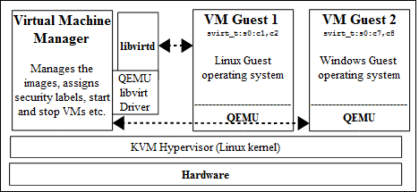
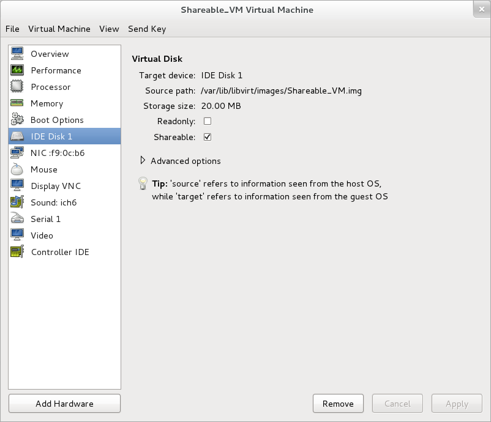
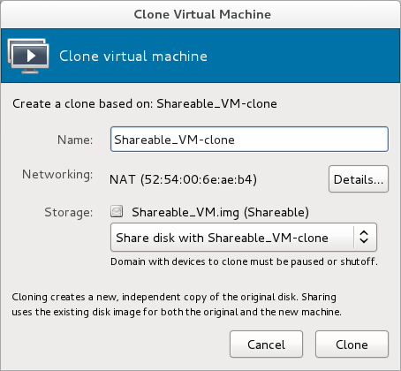
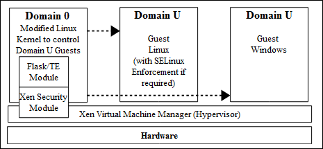

# SELinux Virtual Machine Support

- [KVM / QEMU Support](#kvm-qemu-support)
- [*libvirt* Support](#libvirt-support)
- [VM Image Labeling](#vm-image-labeling)
  - [Dynamic Labeling](#dynamic-labeling)
  - [Shared Image](#shared-image)
  - [Static Labeling](#static-labeling)
- [Xen Support](#xen-support)

SELinux support is available in the KVM/QEMU and Xen virtual machine (VM)
technologies[^fn_vms_1] that are discussed in the sections that follow, however
the package documentation should be read for how these products actually work
and how they are configured.

Currently the main SELinux support for virtualisation is via *libvirt*
that is an open-source virtualisation API used to dynamically load guest
VMs. Security extensions were added as a part of the
[**Svirt**](https://www.redhat.com/en/resources/secure-virtualization-with-svirt)
project and the SELinux implementation for the KVM/QEMU package (*qemu-kvm*
and *libvirt* rpms) is discussed using some examples. The Xen product has
Flask/TE services that can be built as an optional service, although it can
also use the security enhanced *libvirt* services as well.

The sections that follow give an introduction to KVM/QEMU, then
*libvirt* support with some examples using the Virtual Machine Manager
to configure VMs, then an overview of the Xen implementation follows.

To ensure all dependencies are installed run:

```
dnf install libvirt qemu virt-manager
```

## KVM / QEMU Support

KVM is a kernel loadable module that uses the Linux kernel as a
hypervisor and makes use of a modified QEMU emulator to support the
hardware I/O emulation. The
"[**Kernel-based Virtual Machine**](https://www.redhat.com/en/topics/virtualization/what-is-KVM)"
gives a good overview of how KVM and QEMU are implemented. It also
provides an introduction to virtualisation in general. Note that KVM
requires virtulisation support in the CPU (Intel-VT or AMD-V extensions).

The SELinux support for VMs is implemented by the *libvirt* sub-system
that is used to manage the VM images using a Virtual Machine Manager,
and as KVM is based on Linux it has SELinux support by default. There
are also Reference Policy modules to support the overall infrastructure
(KVM support is in various kernel and system modules with a *virt*
module supporting the *libvirt* services). **Figure 18: KVM Environment**
shows a high level overview with two VMs running in their own domains. The
[***libvirt***](#libvirt-support) Support section shows how to
configure these and their VM image files.



**Figure 18: KVM Environment** - *KVM provides the hypervisor while
QEMU provides the hardware emulation services for the guest
operating systems. Note that KVM requires CPU virtualisation support.*

## *libvirt* Support

The Svirt project added security hooks into the *libvirt* library that
is used by the *libvirtd* daemon. This daemon is used by a number of VM
products (such as KVM, QEMU and Xen) to start their VMs running as guest
operating systems.

The VM supplier can implement any security mechanism they require using
a product specific libvirt [**driver**](http://libvirt.org/drvqemu.html)
that will load and manage the images. The SELinux implementation
supports four methods of labeling VM images, processes and their
resources with support from the Reference Policy *modules/services/virt*
loadable module. To support this labeling, *libvirt* requires an MCS or MLS
enabled policy as the [***level***](security_context.md#security-context)
entry of the security context is used (*user:role:type:level*).

The link <http://libvirt.org/drvqemu.html#securityselinux> has details
regarding the QEMU driver and the SELinux confinement modes it supports.

## VM Image Labeling

This sections assumes VM images have been generated using the simple
Linux kernel available at: <http://wiki.qemu.org/Testing> (the
*linux-0.2.img.bz2* disk image), this image was renamed to reflect each
test, for example '*Dynamic_VM1.img*'.

These images can be generated using the VMM by selecting the 'Create a
new virtual machine' menu, 'importing existing disk image' then in step
2 Browse... selecting 'Choose Volume: *Dynamic_VM1.img*' with OS type:
*Linux*, Version: *Generic 2.6.x kernel* and change step 4 'Name' to
*Dynamic_VM1*.

### Dynamic Labeling

The default mode is where each VM is run under its own dynamically
configured domain and image file therefore isolating the VMs from each
other (i.e. every time the VM is run a different and unique MCS label
will be generated to confine each VM to its own domain). This mode is
implemented as follows:

1. An initial context for the process is obtained from the
   */etc/selinux/\<SELINUXTYPE\>/contexts/virtual_domain_context*
   file (the default is *system_u:system_r:svirt_tcg_t:s0*).
2. An initial context for the image file label is obtained from the
   */etc/selinux/\<SELINUXTYPE\>/contexts/virtual_image_context*
   file. The default is *system_u:system_r:svirt_image_t:s0* that
   allows read/write of image files.
3. When the image is used to start the VM, a random MCS *level* is
   generated and added to the process context and the image file
   context. The process and image files are then transitioned to the
   context by the *libselinux* API calls *setfilecon* and *setexeccon*
   respectively (see *security_selinux.c* in the *libvirt *source).
   The following example shows two running VM sessions each having
   different labels:

| VM Image    | Object    | Dynamically assigned security context             |
| ------------| --------- | ------------------------------------------------- |
| Dynamic_VM1 | *process* | *system_u:system_r:svirt_tcg_t:s0:c585,c813*      |
|             | *file*    | *system_u:system_r:svirt_image_t:s0:c585,c813*    |
| Dynamic_VM2 | *process* | *system_u:system_r:svirt_tcg_t:s0:c535,c601*      |
|             | *file*    | *system_u:system_r:svirt_image_t:s0:c535,c601*    |

The running image *ls -Z* and *ps -eZ* are as follows, and for
completeness an *ls -Z* is shown when both VMs have been stopped:

```
# Both VMs running:

ls -Z /var/lib/libvirt/images
system_u:object_r:svirt_image_t:s0:c585,c813 Dynamic_VM1.img
system_u:object_r:svirt_image_t:s0:c535,c601 Dynamic_VM2.img

ps -eZ | grep qemu
system_u:system_r:svirt_tcg_t:s0:c585,c813 8707 ? 00:00:44 qemu-system-x86

system_u:system_r:svirt_tcg_t:s0:cc535,c601 8796 ? 00:00:37 qemu-system-x86
```

```
# Both VMs stopped (note that the categories are now missing AND
# the type has changed from svirt_image_t to virt_image_t):

ls -Z /var/lib/libvirt/images
system_u:object_r:virt_image_t:s0 Dynamic_VM1.img
system_u:object_r:virt_image_t:s0 Dynamic_VM2.img
```

### Shared Image

If the disk image has been set to shared, then a dynamically allocated
*level* will be generated for each VM process instance, however there
will be a single instance of the disk image.

The Virtual Machine Manager can be used to set the image as shareable by
checking the *Shareable* box as shown in **Figure 19**.



**Figure 19: Setting the Virtual Disk as Shareable**

This will set the image (*Shareable_VM.xml*) resource XML
configuration file located in the */etc/libvirt/qemu* directory
*\<disk\>* contents as follows:

```
# /etc/libvirt/qemu/Shareable_VM.xml:

<disk type='file' device='disk'>
	<driver name='qemu' type='raw'/>
	<source file='/var/lib/libvirt/images/Shareable_VM.img'/>
	<target dev='hda' bus='ide'/>
	<shareable/>
	<address type='drive' controller='0' bus='0' unit='0'/>
</disk>
```

As the two VMs will share the same image, the *Shareable_VM* service
needs to be cloned and the VM resource name selected was
*Shareable_VM-clone* as shown in the following screen shot:



The resource XML file *\<disk\>* contents generated are shown - note
that it has the same *source file* name as the *Shareable_VM.xml* file
shown above.

```
# /etc/libvirt/qemu/Shareable_VM-clone.xml:

<disk type='file' device='disk'>
	<driver name='qemu' type='raw'/>
	<source file='/var/lib/libvirt/images/Shareable_VM.img'/>
	<target dev='hda' bus='ide'/>
	<shareable/>
	<address type='drive' controller='0' bus='0' unit='0'/>
</disk>
```

With the targeted policy on Fedora the shareable option gave a error when
the VMs were run as follows:

- **Could not allocate dynamic translator buffer**

The audit log contained the following AVC message:

```
type=AVC msg=audit(1326028680.405:367): avc: denied { execmem } for
pid=5404 comm="qemu-system-x86"
scontext=system_u:system_r:svirt_t:s0:c121,c746
tcontext=system_u:system_r:svirt_t:s0:c121,c746 tclass=process
```

To overcome this error, the following boolean needs to be enabled with
***setsebool**(8)* to allow access to shared memory (the *-P* option
will set the boolean across reboots):

```
setsebool -P virt_use_execmem on
```

Now that the image has been configured as shareable, the following
initialisation process will take place:

1. An initial context for the process is obtained from the
   */etc/selinux/\<SELINUXTYPE\>/contexts/virtual_domain_context*
   file (the default is *system_u:system_r:svirt_tcg_t:s0*).
2. An initial context for the image file label is obtained from the
   */etc/selinux/\<SELINUXTYPE\>/contexts/virtual_image_context*
   file. The default is *system_u:system_r:svirt_image_t:s0* that
   allows read/write of image files.
3. When the image is used to start the VM a random MCS level is
   generated and added to the process context (but not the image file).
   The process is then transitioned to the appropriate context by the*
   libselinux* API calls *setfilecon* and *setexeccon* respectively.
   The following example shows each VM having the same file label but
   different process labels:

| VM Image           | Object    | Security context                             |
| -------------------| ----------| -------------------------------------------- |
| Shareable_VM       | *process* | *system_u:system_r:svirt_tcg_t:s0:c231,c245* |
| Shareable_VM-clone | *process* | *system_u:system_r:svirt_tcg_t:s0:c695,c894* |
|                    | *file*    | *system_u:system_r:svirt_image_t:s0*         |

The running image *ls -Z* and *ps -eZ* are as follows and for
completeness an *ls -Z* is shown when both VMs have been stopped:

```
# Both VMs running and sharing same image:

ls -Z /var/lib/libvirt/images
system_u:object_r:svirt_image_t:s0 Shareable_VM.img

# but with separate processes:
ps -eZ | grep qemu
system_u:system_r:svirt_t:s0:c231,c254 6748 ? 00:01:17 qemu-system-x86
system_u:system_r:svirt_t:s0:c695,c894 7664 ? 00:00:03 qemu-system-x86
```

```
# Both VMs stopped (note that the type has remained as svirt_image_t)

ls -Z /var/lib/libvirt/images
system_u:object_r:svirt_image_t:s0 Shareable_VM.img
```

### Static Labeling

It is possible to set static labels on each image file, however a
consequence of this is that the image cannot be cloned using the VMM,
therefore an image for each VM will be required. This is the method used
to configure VMs on MLS systems as there is a known label that would
define the security level. With this method it is also possible to
configure two or more VMs with the same security context so that they
can share resources. A useful reference is at:
<http://libvirt.org/formatdomain.html#seclabel>.

If using the Virtual Machine Manager GUI, then by default it will start
each VM running as they are built, therefore they need to be stopped and
restarted once configured for static labels, the image file will also
need to be relabeled. An example VM configuration follows where the VM
has been created as *Static_VM1* using the Fedora *targeted* policy in
enforcing mode (just so all errors are flagged during the build):

1. To set the required security context requires editing the
   *Static_VM1* configuration file using ***virsh**(1)* as follows:

```
virsh edit Static_VM1
```

Then add the following at the end of the file:

```
....

</devices>

<!-- The <seclabel> tag needs to be placed btween the existing
	</devices> and </domain> tags -->

	<seclabel type='static' model='selinux' relabel='no'>
		<label>system_u:system_r:svirt_t:s0:c1022,c1023</label>
	</seclabel>
</domain>
```

For this example *svirt_t* has been chosen as it is a valid context
(however it will not run as explained in the text). This context will be
written to the *Static_VM1.xml* configuration file in
*/etc/libvirt/qemu*.

2. If the VM is now started an error will be shown as follows:


**Figure 21: Image Start Error**

This is because the image file label is incorrect as by default
it is labeled *virt_image_t* when the VM image is built (and
*svirt_t* does not have read/write permission for this label):

```
# The default label of the image at build time:

system_u:object_r:virt_image_t:s0 Static_VM1.img
```

There are a number of ways to fix this, such as adding an allow rule or
changing the image file label. In this example the image file label will
be changed using ***chcon**(1)* as follows:

```
# This command is executed from /var/lib/libvirt/images
#
# This sets the correct type:

chcon -t svirt_image_t Static_VM1.img
```

Optionally, the image can also be relabeled so that the *[level]* is
the same as the process using *chcon* as follows:

```
# This command is executed from /var/lib/libvirt/images
#
# Set the MCS label to match the process (optional step):

chcon -l s0:c1022,c1023 Static_VM1.img
```

3. Now that the image has been relabeled, the VM can now be started.

The following example shows two static VMs (one is configured for
*unconfined_t* that is allowed to run under the targeted policy - this
was possible because the '*setsebool -P virt_transition_userdomain
on*' boolean was set that allows *virtd_t* domain to transition to a
user domain (e.g. *unconfined_t*).

| VM Image   | Object    | Static security context                            |
| -----------| --------- | -------------------------------------------------- |
| Static_VM1 | *process* | *system_u:system_r:svirt_t:s0:c1022,c1023*         |
|            | *file*    | *system_u:system_r:svirt_image_t:s0:c1022,c1023*   |
| Static_VM2 | *process* | *system_u:system_r:unconfined_t:s0:c11,c22*        |
|            | *file*    | *system_u:system_r:virt_image_t:s0*                |

The running image *ls -Z* and *ps -eZ* are as follows, and for
completeness an *ls -Z* is shown when both VMs have been stopped:

```
# Both VMs running (Note that Static_VM2 did not have file level reset):

ls -Z /var/lib/libvirt/images
system_u:object_r:svirt_image_t:s0:c1022,c1023 Static_VM1.img
system_u:object_r:virt_image_t:s0 Static_VM2.img

ps -eZ | grep qemu
system_u:system_r:svirt_t:s0:c585,c813 6707 ? 00:00:45 qemu-system-x86
system_u:system_r:unconfined_t:s0:c11,c22 6796 ? 00:00:26 qemu-system-x86
```

```
# Both VMs stopped (note that Static_VM1.img was relabeled svirt_image_t
# to enable it to run, however Static_VM2.img is still labeled
# virt_image_t and runs okay. This is because the process is run as
# unconfined_t that is allowed to use virt_image_t):

system_u:object_r:svirt_image_t:s0:c1022,c1023 Static_VM1.img
system_u:object_r:virt_image_t:s0 Static_VM2.img
```

## Xen Support

This is not supported by SELinux in the usual way as it is built into
the actual Xen software as a 'Flask/TE' extension for the XSM (Xen
Security Module). Also the Xen implementation has its own built-in
policy (*xen.te*) and supporting definitions for access vectors,
security classes and initial SIDs for the policy. These Flask/TE
components run in Domain 0 as part of the domain management and control
supporting the Virtual Machine Monitor (VMM) as shown in
**Figure 22: Xen Hypervisor**.



**Figure 22: Xen Hypervisor** - *Using XSM and Flask/TE to enforce
policy on the physical I/O resources*

The "[**How Does Xen Work**](http://www.xen.org/files/Marketing/HowDoesXenWork.pdf)"
document describes the basic operation of Xen, the
"[**Xen Security Modules**](http://www.xen.org/files/xensummit_4/xsm-summit-041707_Coker.pdf)"
describes the XSM/Flask implementation, and the *xsm-flask.txt*
file in the Xen source package describes how SELinux and its supporting
policy is implemented.

However (just to confuse the issue), there is another Xen policy module
(also called *xen.te*) in the Reference Policy to support the management
of images etc. via the Xen console.

For reference, the Xen policy supports additional policy language
statements that defined in the
[**Xen Statements**](xen_statements.md#xen-statements) section.

[^fn_vms_1]: KVM (Kernel-based Virtual Machine) and Xen are classed as 'bare
metal' hypervisors and they rely on other services to manage the overall VM
environment. QEMU (Quick Emulator) is an emulator that emulates the BIOS and
I/O device functionality and can be used standalone or with KVM and Xen.

<!-- %CUTHERE% -->

---
**[[ PREV ]](network_support.md)** **[[ TOP ]](#)** **[[ NEXT ]](x_windows.md)**
